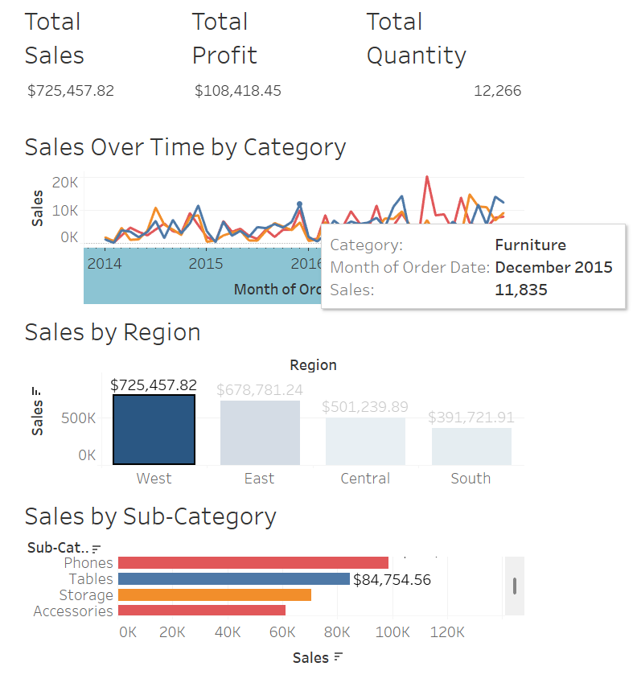

# 📊 Task 4 – Superstore Sales Dashboard (ElevateLabs Internship)

This project was completed as part of **Task 4** for the **ElevateLabs Data Analyst Internship**.  
The objective was to design a clean, interactive dashboard using Tableau to explore and present sales data from the Sample Superstore dataset.

---

## 🧠 Objective

To enable business stakeholders to easily analyze product, region, and category-level performance using a single-page interactive dashboard.

---

## 📁 Files Included

| File | Description |
|------|-------------|
| `Task4_Superstore_Dashboard.twbx` | Tableau workbook |
| `Task4_Summary_Presentation.pptx` | Summary presentation (5 slides) |
| `dashboard-preview.png` | Screenshot of full dashboard |
| `kpi-snapshot.png` | Screenshot of KPI cards |
| `README.md` | This file |

---

## 📊 Dashboard Features

- 💰 **KPI Cards**: Total Sales, Profit, and Quantity
- 📈 **Sales Trend**: Monthly sales by category
- 🗺️ **Regional Analysis**: Sales by region with profit-based color
- 📦 **Product View**: Sales by sub-category (sorted)
- 🎛️ **Interactivity**: Click filters (e.g., region) to update entire dashboard

---

## 🔧 Tools Used

- **Tableau Desktop** – Dashboard development
- **Google Slides** – Presentation
- **Excel (Sample Superstore)** – Dataset
- **GitHub** – Version control and submission

---

## 👤 Author

**Preetham**  
Submitted for the **ElevateLabs Data Analyst Internship – Task 4**

---

